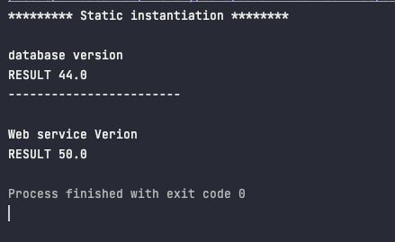

<h1> STATIC INSTANTIATION </h1>

 Strong coupling in presentation layer 

 

 

 result

 

<h1> DYNAMIC INSTANTIATION </h1>

 WEAK coupling in presentation layer 

 

 

 result

 

<h1> SPRING WITH XML CONFIG </h1>

 

 result

